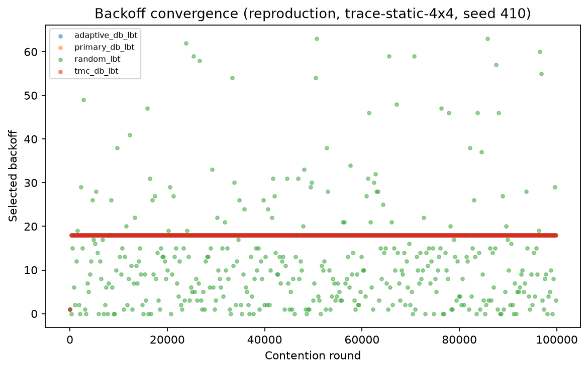
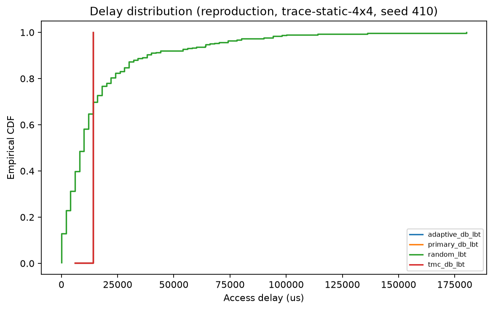
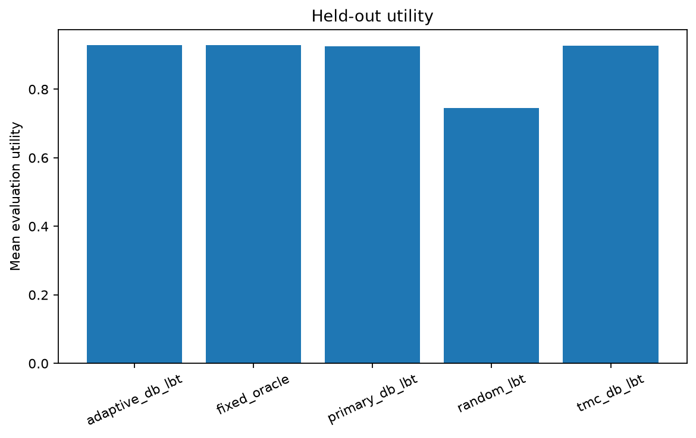
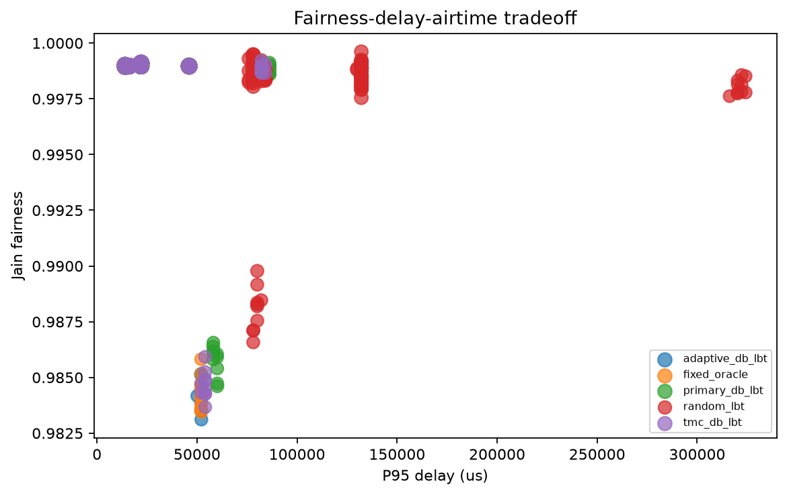
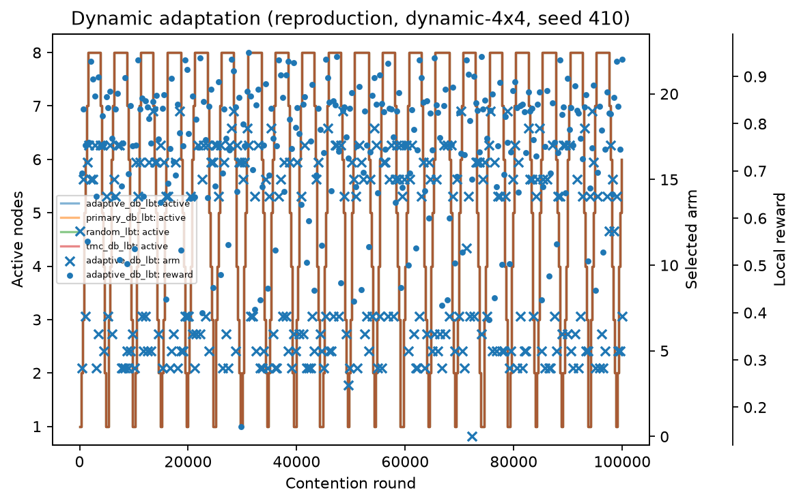
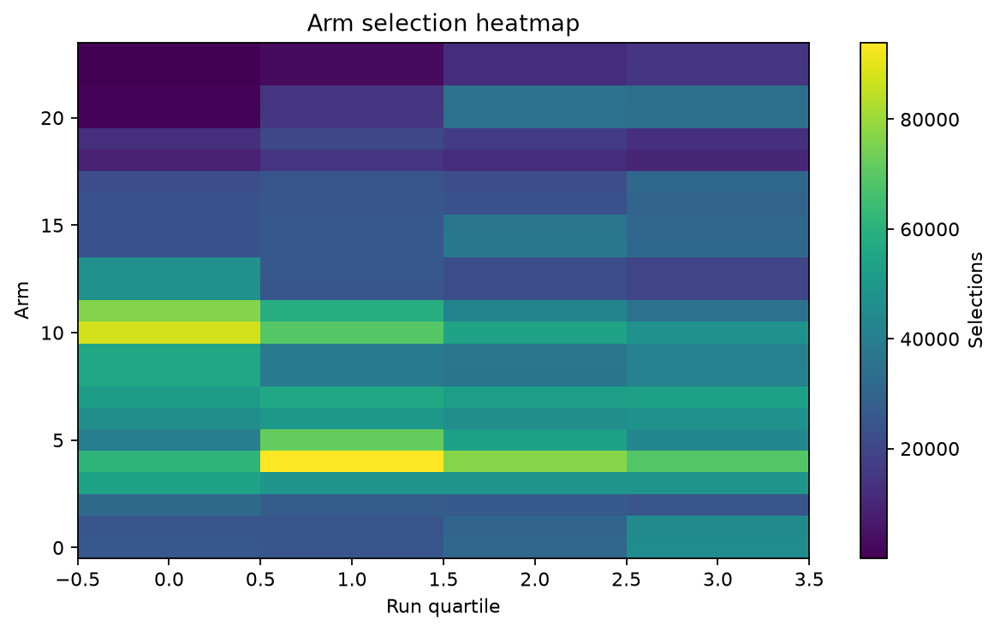
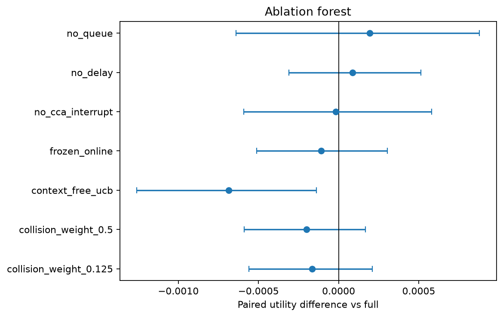

# Experimental Appendix

This online appendix accompanies *Distributed LinUCB-Based Adaptive DB-LBT
with Local Observations for Wi-Fi/NR-U Coexistence*. It records the complete
experimental configuration, seed policy, extended results, and artifact map
without consuming pages in the six-page conference manuscript.

## 1. Experiment Inventory and Seeds

Each event run contains 100,000 contention rounds. Pretraining uses seeds
`1103`, `2207`, and `3301`. Formal event comparisons use paired seeds `410`,
`523`, `631`, `742`, `859`, `967`, `1081`, `1193`, `1307`, and `1429`.
Packet-level validation uses the first three formal seeds.

| Evidence set | Jobs | Scenario scope | Policies or conditions |
|---|---:|---|---|
| Pretraining | 792 | 11 topology, Poisson-load, periodic-occupancy, and sensing-perturbation conditions | One fixed arm per job across all 24 arms |
| Reproduction | 360 | Static 1+1 through 16+16, active-set changes, legacy APs/stations | Random, primary DB-LBT, fixed TMC, adaptive |
| Held-out | 500 | Unseen density/asymmetry, Poisson load, periodic occupancy, perturbation, combined dynamic | Adds the training-seed fixed oracle |
| Ablation | 80 | Combined dynamic 4+4 | Full, feature removals, frozen update, UCB, reward weights |
| Event/ns-3 match | 18/27 | Static 4+4, load-change 4+4, periodic-interference 6+6 | Fixed TMC versus adaptive; random ns-3 diagnostic |

The exact matrices are in [`configs/matrices/`](../configs/matrices/).

## 2. Protocol and Controller Configuration

One event round advances by the smallest remaining backoff. A single node at
zero succeeds; simultaneous zeros collide. Wi-Fi and NR-U occupy 2 ms, and
NR-U reserves time to the next 250 us boundary. Random LBT uses `CWmin=15` and
`CWmax=63`. Fixed TMC uses
`(kappa, beta, m, b_init) = (7, 3, 6, 15)` with `alpha=11`.

The adaptive grid is:

- `kappa` in `{5, 7}`
- `beta` in `{2, 3}`
- `m` in `{4, 6, 10}`
- `b_init` in `{15, 31}`

Their Cartesian product gives 24 legal arms. Each node constructs 11 local
features from at most 64 of its own attempts. Event decisions occur every 32
global contention rounds after eight observations; ns-3 decisions occur every
32 completed local attempts. LinUCB uses exploration coefficient `0.5`.

The reporting utility is separate from the learner reward:

```text
U_D    = 1 - clip(D95 / 500 ms, 0, 1)
U_eval = (A_total + U_D + Jain) / 3 - 0.25 P_collision
```

Policy comparisons pair identical exogenous seeds. Confidence intervals use a
10,000-resample paired bootstrap over seed-level differences.

## 3. Scenario Matrix

| Matrix | Node/load cases | Occupancy or active-set cases | Purpose |
|---|---|---|---|
| Pretraining | 2+2, 4+4, 8+8; Poisson 0.02/0.05/0.08 packets/ms | Periodic 10/100/1000 ms; interruption noise 0.4/1.0 | Initialize all arms across broad local contexts |
| Reproduction | Static 1+1, 2+2, 4+4, 8+8, 16+16 | Joins every 10 rounds with 200-round lifetime; legacy AP/station | Check spacing, scaling, activation, and mixed random access |
| Held-out | 6+6, 12+12, 4+8, 8+4; Poisson 0.035/0.065 packets/ms | Periodic 30/300 ms; noise 0.8; combined dynamic 4+4 | Test unseen density, asymmetry, load, CCA freezing, and generalization |
| ns-3 | Static 4+4, load-change 4+4, periodic-interference 6+6 | Half-run load change; 2-ms waveform every 300 ms | Add EDCA, ACK/HARQ, PHY interference, and NR-U alignment |

## 4. Mechanism Validation





In static 4+4, Random LBT has collision probability `0.229707`, P95 delay
`77.881 ms`, and effective airtime `0.745526`. Fixed TMC reduces these to
`0.000139`, `14.018 ms`, and `0.967666`; adaptive is numerically identical. At
16+16, fixed TMC retains `0.965393` airtime with collision probability
`0.002921`, while adaptive retains `0.964906` and `0.003446`.

## 5. Registered Event Outcomes

| Test | Criterion | Adaptive - fixed TMC | 95% paired interval | Outcome |
|---|---|---:|---|---|
| H1 | Stable utility loss no worse than 2% | -0.0000007 | [-0.00002907, 0.00003215] | Pass |
| H2 | Non-ideal utility improvement at least 10% | +0.002593 | [0.002456, 0.002740] | Fail |
| H3 | Jain fairness loss no worse than 0.01 | -0.00003919 | [-0.00006348, -0.00001635] | Pass |
| H4 | Aggregate held-out utility difference above zero | +0.001556 | [0.001470, 0.001651] | Pass |
| H5 | At least two event/ns-3 directional agreements | NA, false, NA | Two tied event scenarios | Inconclusive |





The aggregate improvement is scenario dependent. Light Poisson and combined
dynamic cases drive the positive mean; heavy Poisson slightly degrades, while
several periodic and sensing-perturbation cases tie at retained precision.
The complete seed-level table is
[`results/tables/per-seed.csv`](../results/tables/per-seed.csv).

## 6. Controller Behavior and Ablations







Replacing LinUCB with context-free UCB lowers utility by `0.000686`, with 95%
interval `[-0.001259, -0.000138]`. Removing queue, delay, or
CCA/interruption features one group at a time produces intervals crossing
zero, as does freezing online updates.

## 7. Packet-Level ns-3 Results

The packet model uses ns-3.35, 5G-LENA 1.2.y, and the pinned NR-U module. Each
scenario runs for two seconds. Wi-Fi and NR-U share a 3GPP Indoor Mixed Office
path-loss and frequency-selective spectrum channel. Shadowing is disabled,
positions are fixed, and zero update periods retain one sampled channel matrix
and LOS/NLOS condition per run.

| Scenario | Technology | Throughput delta (Mbit/s) | Mean-delay delta (us) | Packet-loss-ratio delta |
|---|---|---:|---:|---:|
| Static 4+4 | Wi-Fi | -0.0259 | -78.0 | +0.00316 |
| Static 4+4 | NR-U | -0.1142 | +3833.1 | +0.01392 |
| Load-change 4+4 | Wi-Fi | +0.3213 | +36.4 | -0.05225 |
| Load-change 4+4 | NR-U | -0.0122 | +1621.9 | +0.00198 |
| Periodic-interference 6+6 | Wi-Fi | -0.2300 | -397.0 | +0.01868 |
| Periodic-interference 6+6 | NR-U | -0.0091 | -2882.3 | +0.00074 |

Packet-level directions are unfavorable under the registered joint vote in all
three scenario classes. The event direction is tied for static and periodic
cases and favorable for load change, yielding the registered H5 result
`inconclusive`. See [`ns3/validation-results/`](../ns3/validation-results/)
for databases, manifests, reduced metrics, and audit metadata.

## 8. Data and Integrity Map

- Event summary: [`results/tables/per-seed.csv`](../results/tables/per-seed.csv)
- Registered outcomes: [`results/tables/final-hypotheses.csv`](../results/tables/final-hypotheses.csv)
- Cross-model table: [`results/tables/cross-model-scenarios.csv`](../results/tables/cross-model-scenarios.csv)
- Plot-ready data: [`results/figures/formal/tables/`](../results/figures/formal/tables/)
- Trained model: [`models/linucb-initial.npz`](../models/linucb-initial.npz)
- Packet-level databases: [`ns3/validation-results/formal/databases/`](../ns3/validation-results/formal/databases/)
- Reproduction commands: [`docs/reproduction.md`](reproduction.md)

All 27 packet-level SQLite databases are retained. The approximately 6.87 GiB
event round records are regenerated from committed matrices and seeds with
`scripts/run_overnight.sh`; the canonical 940-row seed-level result table is
retained in Git.
